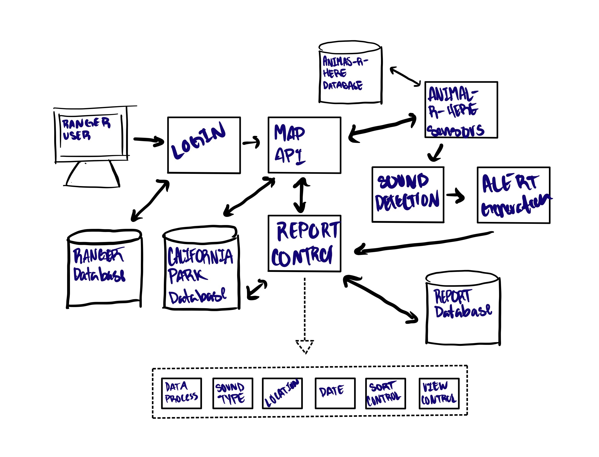

# Mountain Lion Detection System
Created by: Bryan Aguilar, Jacel Evangelista, Hunter Paul 

## Overview
The Mountain Lion Detection System is a system that will help detect and alarm park rangers 
of any animal noises within the park. In order to achieve this there will be classes, 
and methods within the classes, to attend to any specific alarm/alert scenario. This program is 
specifically meant to detect mountain lions and hence will focus a lot on the detection of any specific 
sounds/noises of animals. Therefore, the sensors will be programmed to detect animal noises. This 
software will start with designing the Pop-Up Alert which will be called if any noises are 
picked up and that will be handled with a class called Alarm. That class will be the basis of 
capturing any sort of alarms throughout the park and will determine if the noise captured is an 
actual mountain lion. That class will therefore have a check system to see if the noise captured 
is a mountain lion. Another class will be constructed to notify the park rangers and have another 
to note the dates of every alarm. Another class will pinpoint the actual location and display that 
to the user. Finally, in order to access the alarm system the park rangers must login to 
turn off the alarm once it is triggered and access the location of the set off alarm. 

## Diagrams

### Architectural Diagram

 The Animal-R-Here sensors will detect sounds of animals and generate an alert to the park ranger terminal. From here 
the software will sound an audio alarm to get the attention of park rangers, then pull information from the California 
Park Database in order to creating a report detailing the sound type detected, location of the noise, and the date when 
it was detected. Afterwards the report will be stored in the database for future reference. When a park ranger logs on 
in order to disable the alarm and check the report, the system will match their credentials against the park ranger database
before allowing them to access a map api showing the report and the location of the detection.

 Modifications Made: The only modification made to the diagram was the addition of the Animal-R-Here database, which was 
added in order to reflect our current database management strategy.

### UML Diagram

## UML Descriptions

### Classes
UserRanger:  
This class is designed to have individual rangers input their login credentials and validate it, in order to login to the system.  
  
ControlSystem:  
This class is meant to design the specific alarm that will be set whenever an animal is detected and logout when necessary.  
  
AlarmSystem:  
This class is designed to create the alarm when it has been set off and determines what type of alarm it would be based on the animal detected.  
  
Alarm:  
This class is designed to send all attributes of the given alarm to the alarm system to determine which alarm to set off / which animal has been detected and the location of such alert.  
  
ParkControl:  
This class is designed to notify the security/rangers and to do the necessary steps when an alarm is called.  
  
MapSystem:  
This class is the source of the map and can determine where the sound was detected and return such location through its sensors.  
  
Report:  
The Report class works as a live After-Action Report on the situation that triggered the alarm; it is used to show the user what is going on, on what sound was played, to when it happened, to the location, etc.   
  
AnimalRHere:  
This class is the main sensor/trigger for sounds regarding the animals. It can determine where the alarm was triggered and send what type of sound it was.  

### Attributes
The class userRanger has four attributes; Fullname, rangerId, username, and password. Fullname is a public string variable that will store the first and 
last name of the park ranger logging into the account; rangerId is a public long variable that will store the numerical Id associated with the ranger account; 
username is a public string variable that stores the account username that the ranger uses to login to the account; password is a public string variable that stores the 
password used to log into the ranger account.  
  
The class ControlSystem has one attribute, sensor. Sensor is a public variable of type sensors that will be used to create alarm systems and activate them.
by the system.  
  
The class Alarm has 5 attributes: name, time, location, sound, and AlertType. Name is a public string variable that holds the name of the alarm; time is a public int
variable that will store the time when the alarm is activated; location is a public long variable that will store the location of where the alarm was activated; sound 
is a public variable that will store the sound that was captured when the alarm was activated; AlertType is a public string that will store the type of alert that
caused the alarm activation.  

The class AlarmSystem has 3 attributes; sound, detectionType, and alert. Sound is a public variable that will store the sound variable from the alarm class if the 
alarm goes off; detectionType is a public string variable that will store what type of detection that the system captured; alert is a public instance of the alarm class 
that will be used to interact with the attributes of the alarm class.  
  
The class Report has 5 attributes; sound, date, location, alertType, and reportType. Sound is a public string variable that will store the type of sound that was captured when the 
alarm was triggered; date is a public string variable that will store the date at which the alert was triggered; location is a public string variable that will store the location 
where the alarm was activated; alertType is a public string that will store the type of alert that was captured when the alarm went off; reportType is a public string variable that 
will store the type of report that was created by the alarm system.  
  
The class AnimalRHere has 1 attribute, feed. Feed is a private variable of type soundStream that will store a recording of a captured sound when the alarm system was triggered.  
  
The class MapSystem has 2 attributes, sensorList and MapControl. sensorList is a public variable of type Sensors that will store a list of all active sensors currently in the 
park and display them on the map, and MapControl is a public variable of type MapSystem that will be used by the park ranger to interact with the map.

### Operations
Looking above at the UML Diagram you are demonstrated with multiple operations/methods. As 
shown in the userRanger class we are presented with eight operations. The first six operations are 
designed to get and set each ranger’s name, username, and password. Lastly, the last two 
operations are tasked to inspect whether the ranger is in the database, and if found the system 
will give the user access to the detection system. Moving on to the Control System class we are 
given three operations. The first two operations are related to creating the alarm and the sound in 
which the alarm produces whenever a mountain lion is detected. Lastly, the class will also have 
an operation that will allow the user to log out of the system. The Alarm System consists of 3 
basic methods. The task for these methods is to get the location of sensors whenever an alarm 
goes off and the ability to turn off the alarm. However, the Alarm System won’t work without the 
Alarm Class. The alarm class is what helps the alarm system by getting the time at which an 
alarm goes off, the name of the alarm, and the ability to map out an alarm/sensor. Continuing to 
the Map System we are given the operations to get data from the sensors and also receive park 
control from the Park Control class. In order to gain access to the Park Control the system will 
go through the security protocol operation to make sure the ranger has access to modify the map. 
The Animals-R-Here class consists of the operations to get the sound of the sensors and send 
them back to the software and database. Finally, our Report class contains two operations that 
sort the reports according to the input from the user, and the second function displays the reports.

## Data Management Strategy

### Diagram
