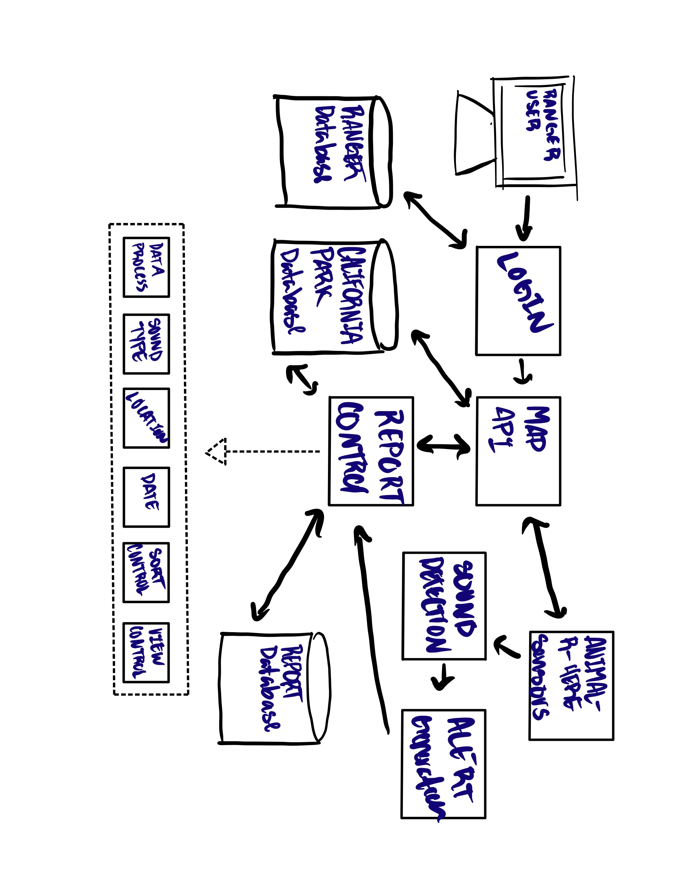

# Mountain Lion Detection System
Created by: Bryan Aguilar, Jacel Evangelista, Hunter Paul 

## Overview
The Mountain Lion Detection System will be a system that will help detect and alarm park rangers 
of any animal noises within the park. In order to achieve this there will be classes, 
and methods within the classes, to attend to any specific alarm/alert scenario. This program is 
specifically meant to detect mountain lions and hence will focus a lot on the detection of any specific 
sounds/noises of animals. Therefore, the sensors will be programmed to detect animal noises. This 
software will start with designing the Pop-Up Alert which will be called if any noises are to be 
picked up and that will be covered with a class called Alarm. That class will be the basis of 
capturing any sort of alarms throughout the park and will determine if the noise captured is an 
actual mountain lion. That class will therefore have a check system to see if the noise captured 
is a mountain lion. Another class will be constructed to notify the park rangers and have another 
to note the dates of every alarm. Another class will pinpoint the actual location and display that 
to the user. Finally, in order to access the alarm system the park rangers must login to therefore 
turn off the alarm once triggered and access the location of such alarm. 

## Diagrams

### Architectural Diagram

 The Animal-R-Here sensors will detect sounds of animals and generate an alert to the park ranger terminal. From here 
the software will sound an audio alarm to get the attention of park rangers, then pull information from the California 
Park Database in order to creating a report detailing the sound type detected, location of the noise, and the date when 
it was detected. Afterwards the report will be stored in the database for future reference. When a park ranger logs on 
in order to disable the alarm and check the report, the system will match their credentials against the park ranger database
before allowing them to access a map api showing the report and the location of the detection.

### UML Diagram

## UML Descriptions

### Classes
Jacel

### Attributes
Hunter

### Operations
Bryan

## Development Plan and Timeline

### Partitioning of Tasks
3/2 - Initial commit with title and overview of the system  
3/6 - Create Architectural Diagram  
3/8 - Create UML Diagram and create architectural diagram description  
3/9 - Create UML Diagram class, operations, and attributes descriptions  

### Team Member Responsibilities
Everyone - Description and Diagrams  
Bryan - UML Operations description  
Jacel - UML Classes Description  
Hunter - UML Attributes Description  