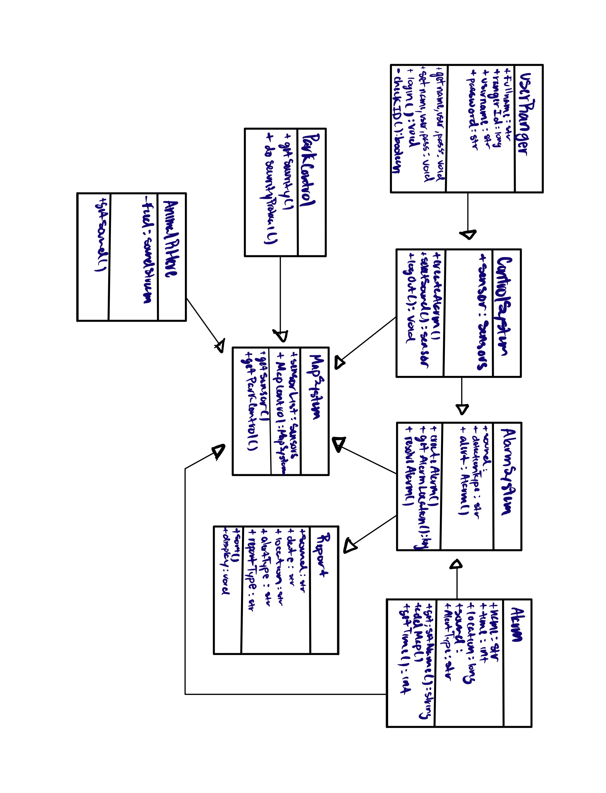

#  Test Plan 
Created by: Bryan Aguilar, Jacel Evangelista, Hunter Paul

##  UML Diagram 

###  Description 
The Animal-R-Here sensors will detect sounds of animals and generate an alert to the park ranger terminal. From here 
the software will sound an audio alarm to get the attention of park rangers, then pull information from the California 
Park Database in order to creating a report detailing the sound type detected, location of the noise, and the date when 
it was detected. Afterwards the report will be stored in the database for future reference. When a park ranger logs on 
in order to disable the alarm and check the report, the system will match their credentials against the park ranger database
before allowing them to access a map api showing the report and the location of the detection.

####  Updates from Previous UML Diagram 
>Insert any new udpates we made here

##  Test Set 1: Access to System 
This/These tests are aimed at testing "Something".

###  Test 
>Put Test Here

This Test is aimed at covering the functionality of...

##  Test Set 2: Alarm Report System 
This/These tests are aimed at testing "Something"

###  Test 1: Alarm Generation 
>Put Test here

This test is aimed at covering the functionality of...

###  Test 2: Report Creation 
