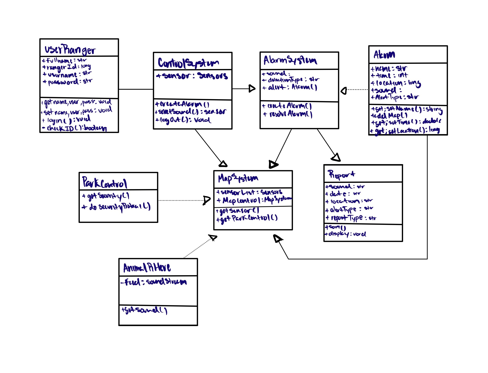

#  Test Plan 
Created by: Bryan Aguilar, Jacel Evangelista, Hunter Paul

##  UML Diagram 

###  Description 
The Animal-R-Here sensors will detect sounds of animals and generate an alert to the park ranger terminal. From here 
the software will sound an audio alarm to get the attention of park rangers, then pull information from the California 
Park Database in order to creating a report detailing the sound type detected, location of the noise, and the date when 
it was detected. Afterwards the report will be stored in the database for future reference. When a park ranger logs on 
in order to disable the alarm and check the report, the system will match their credentials against the park ranger database
before allowing them to access a map api showing the report and the location of the detection.

####  Updates from Previous UML Diagram 
We felt that our diagram was adequate as it is and have not made any changes to it from the previous assignment.

##  Test Set 1: Access to System 
This test is aimed at testing the access to the system specification of our software system. It will test specific units within the code, test the functional integrity of the software, and show the System/acceptance testing of logging into the system. #

###  Test 
- Test Cases: 
    - name: Jacel & Austin;
    - user: JacelE & AustinZ; 
    - password: CS250 & COMM100

- Unit Testing:
    - UserRanger.setname(string name); UserRanger.setuser(string user); UserRanger.setpass(string pass);
        - This is the test if provided with no input will not be called and or logged into the system but if a user and pass is inputted it will then go to the checkID(); system.
        - (e.g UserRanger.setname(JacelE, CS250);)
        - (e.g) if no input given (UserRanger.setname(); -> default to “NULL”)
        - If no input is given the program will graciously end as it will not be able to proceed without an ID or login info.
    - UserRanger.getname(); UserRanger.getuser(); UserRanger.getpass();
        - This unit test gets the name, username, and password of the user.
    - UserRanger.checkID();
        - Since this is a Boolean method it will search the database if it is a valid ID so it can be logged into the system.

- UserRanger.setName(Jacel);
- UserRanger.setuser(JacelE);
- UserRanger.setpass(CS250);
- UserRanger.getName();
- UserRanger.getUser();
- UserRanger.getpass(); 

Return(Jacel,JacelE,CS250);

- Funtional/Integration Testing
    - If valid login/ID
        - UserRanger.setname(JacelE, CS250); -> checkID(); -> login();->ACCESS TO SYSTEM
    - If invalid login/ID
        - UserRanger.setname(AustinZ, COMM100); -> checkID(); ->UserRanger.setname();
    - An input of a login will start the program off by using such login to check if it’s valid and if it returns as true it will be logged into the system via the login() method. But if it to be returned false it will revert back to the start of the program and be asked to log in once more. Hence the functionality of such test works well together through asking for valid logins and not being let through to login() unless a valid ID is given hence working well together in unison.
- System Testing
    - In System Testing the system will not be able to run if the proper login is not given. System testing the login is all determined if the login is valid and hence will successfully be able to start the system.

    - Name: Jacel
    - User: JacelE
    - Password: CS250
    - Login();
    - ACCESS!#

This Test is aimed at covering the functionality of our system so it can properly access/login to the system properly. The unit testing of this program tests if a login is given and if it’s valid and if no input is given it will default to NULL so the program does not crash. The Functional/Integration Function of this System will shows how the functions of the login test works together from setting the username and password to checking if it is valid and lastly calling the login method to properly have access to the whole system. The System testing relies solely on the login() method to therefore have access to the system.

##  Test Set 2: Alarm Report System 
This/These tests are aimed at testing "Something"

###  Test 1: Alarm Generation 
>Put Test here

###  Test 2: Report Creation 
>Put Test here

These tests are aimed at covering the functionality of...